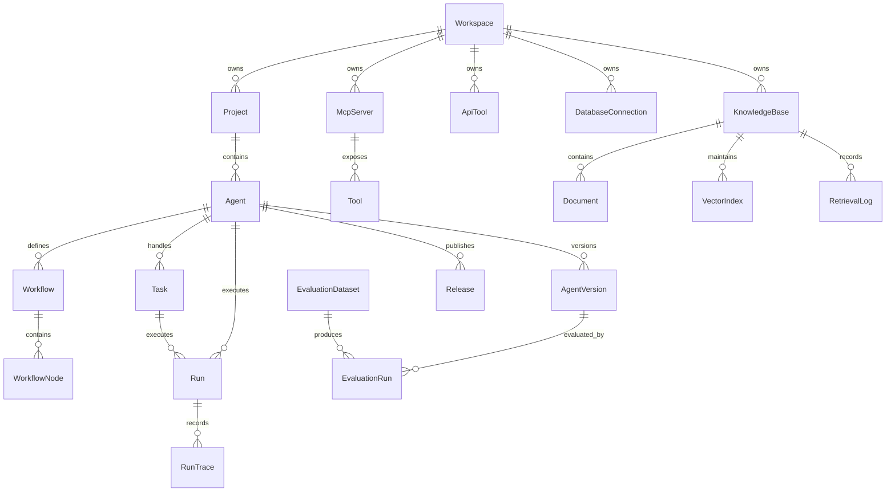

# 领域模型

## 1. 核心实体

### Workspace

空间，承载团队、项目和权限边界。

字段建议：
- id
- name
- description
- ownerId
- createdAt
- updatedAt

### Project

项目，归属于空间，用于组织智能体和资源。

字段建议：
- id
- workspaceId
- name
- environment
- createdAt
- updatedAt

### Agent

智能体，是平台的核心管理对象。

字段建议：
- id
- projectId
- name
- description
- businessScenario
- department
- ownerId
- status
- version
- modelConfig
- promptConfig
- knowledgeConfig
- toolConfig
- securityConfig
- releaseConfig
- observabilityConfig
- currentDraftVersionId
- currentPublishedVersionId
- createdAt
- updatedAt

配置字段建议：
- modelConfig：modelProvider、modelName、temperature、maxTokens、timeoutMs、retryCount
- promptConfig：systemPrompt、roleDefinition、taskBoundary、forbiddenActions、outputFormat
- knowledgeConfig：knowledgeBaseIds、retrievalMode、topK、similarityThreshold、returnCitations、noHitStrategy
- toolConfig：mcpToolIds、apiToolIds、databaseConnectionIds、allowCodeExecution、allowLocalFileReadWrite、toolPermissionScopes
- securityConfig：riskConfirmationRules、fileAccessWhitelist、databaseAccessMode、apiCallPolicy、sensitiveDataPolicy、rateLimit
- releaseConfig：publishAsApi、apiPath、authType、callerWhitelist、requestSchema、responseSchema、concurrencyLimit、logRetentionDays
- observabilityConfig：recordFullTrace、recordModelIO、recordToolDetails、recordKnowledgeRetrieval、errorAlertEnabled

### AgentVersion

智能体版本，保存提示词、模型、工作流和发布配置快照。

字段建议：
- id
- agentId
- version
- status
- modelConfig
- promptConfig
- workflowId
- releaseNote
- createdBy
- createdAt

### Workflow

工作流定义。

字段建议：
- id
- agentId
- versionId
- name
- nodes
- edges
- createdAt
- updatedAt

### WorkflowNode

工作流节点。

节点类型：
- start
- llm
- condition
- tool
- knowledge
- database
- code
- file
- agent
- human_handoff
- end

字段建议：
- id
- workflowId
- type
- name
- position
- config
- createdAt
- updatedAt

### McpServer

MCP 服务连接。

字段建议：
- id
- workspaceId
- name
- transport
- endpoint
- authType
- status
- lastSyncedAt
- createdAt
- updatedAt

### Tool

从 MCP Server 同步或手动注册的工具。

字段建议：
- id
- mcpServerId
- name
- description
- inputSchema
- outputSchema
- permissionPolicy
- status
- createdAt
- updatedAt

### ApiTool

手动注册的外部 API 工具。

字段建议：
- id
- workspaceId
- name
- description
- endpoint
- method
- authType
- requestSchema
- responseSchema
- permissionPolicy
- status
- createdAt
- updatedAt

### DatabaseConnection

Agent 可使用的数据库连接。

字段建议：
- id
- workspaceId
- name
- databaseType
- environment
- endpoint
- authType
- ownerId
- visibilityScope
- accessMode
- status
- createdAt
- updatedAt

### KnowledgeBase

知识库，是平台级独立资源，可被多个 Agent 按权限引用。

字段建议：
- id
- workspaceId
- name
- description
- businessCategory
- ownerId
- visibilityScope
- embeddingModel
- chunkStrategy
- retrievalConfig
- documentCount
- indexStatus
- status
- createdAt
- updatedAt

### Document

知识库文档。

字段建议：
- id
- knowledgeBaseId
- sourceType
- fileName
- fileType
- title
- uri
- uploadedBy
- version
- status
- parseStatus
- vectorizationStatus
- chunkCount
- createdAt
- updatedAt

### VectorIndex

知识库维护的独立向量索引。

字段建议：
- id
- knowledgeBaseId
- embeddingModel
- status
- documentCount
- chunkCount
- lastBuiltAt
- supportsRebuild
- createdAt
- updatedAt

### RetrievalLog

知识库检索日志，归属于具体任务、Agent 和知识库。

字段建议：
- id
- taskId
- runId
- agentId
- knowledgeBaseId
- documentId
- query
- matchedChunk
- similarityScore
- callerType
- callerId
- createdAt

### Task

企业员工在工作台发起的一次任务或会话任务。

字段建议：
- id
- workspaceId
- projectId
- agentId
- createdBy
- title
- status
- progress
- input
- output
- createdAt
- updatedAt

### Run

一次智能体运行。

字段建议：
- id
- taskId
- agentId
- versionId
- channel
- callerType
- callerId
- input
- output
- status
- latencyMs
- promptTokens
- completionTokens
- totalCost
- errorCode
- createdAt

### RunTrace

运行追踪明细。

字段建议：
- id
- runId
- stepIndex
- nodeId
- type
- resourceType
- resourceId
- input
- output
- latencyMs
- tokenUsage
- error
- createdAt

### EvaluationDataset

评测数据集。

字段建议：
- id
- workspaceId
- name
- description
- createdAt
- updatedAt

### EvaluationRun

一次评测运行。

字段建议：
- id
- datasetId
- agentVersionId
- status
- passRate
- avgLatencyMs
- avgCost
- createdAt

### Release

发布记录。

字段建议：
- id
- agentId
- versionId
- environment
- channel
- apiPath
- authType
- callerWhitelist
- requestSchema
- responseSchema
- concurrencyLimit
- logRetentionDays
- status
- releasedBy
- releasedAt
- rollbackFromReleaseId

### AuditLog

审计日志。

字段建议：
- id
- workspaceId
- actorId
- action
- resourceType
- resourceId
- metadata
- createdAt

## 2. 状态枚举

AgentStatus：
- draft
- enabled
- disabled
- testing
- published
- error
- archived

ToolStatus：
- online
- degraded
- schema_error
- unauthorized
- offline

RunStatus：
- running
- succeeded
- failed
- canceled

ReleaseStatus：
- draft
- checking
- blocked
- published
- rolled_back

KnowledgeBaseStatus：
- enabled
- disabled
- archived

DocumentProcessStatus：
- pending
- parsing
- parsed
- vectorizing
- indexed
- failed

IndexStatus：
- empty
- building
- ready
- stale
- failed

DatabaseAccessMode：
- readonly
- writable

## 3. 关系概览

