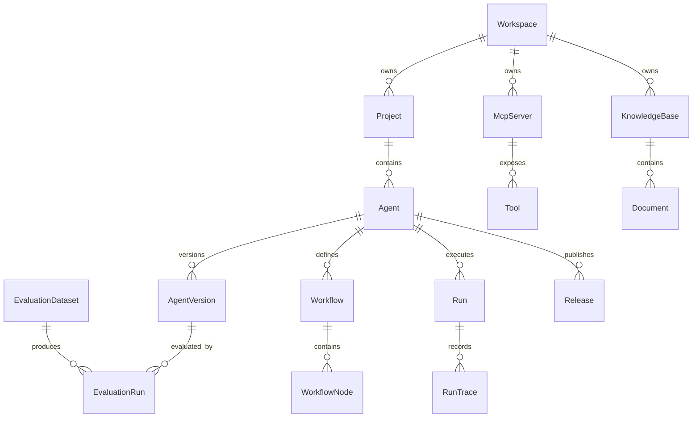

# 领域模型

## 1. 核心实体

### Workspace

空间，承载团队、项目和权限边界。

字段建议：
- id
- name
- description
- ownerId
- createdAt
- updatedAt

### Project

项目，归属于空间，用于组织智能体和资源。

字段建议：
- id
- workspaceId
- name
- environment
- createdAt
- updatedAt

### Agent

智能体，是平台的核心管理对象。

字段建议：
- id
- projectId
- name
- description
- avatar
- tags
- ownerId
- status
- currentDraftVersionId
- currentPublishedVersionId
- createdAt
- updatedAt

### AgentVersion

智能体版本，保存提示词、模型、工作流和发布配置快照。

字段建议：
- id
- agentId
- version
- status
- modelConfig
- promptConfig
- workflowId
- releaseNote
- createdBy
- createdAt

### Workflow

工作流定义。

字段建议：
- id
- agentId
- versionId
- name
- nodes
- edges
- createdAt
- updatedAt

### WorkflowNode

工作流节点。

节点类型：
- start
- llm
- condition
- tool
- knowledge
- code
- human_handoff
- end

字段建议：
- id
- workflowId
- type
- name
- position
- config
- createdAt
- updatedAt

### McpServer

MCP 服务连接。

字段建议：
- id
- workspaceId
- name
- transport
- endpoint
- authType
- status
- lastSyncedAt
- createdAt
- updatedAt

### Tool

从 MCP Server 同步或手动注册的工具。

字段建议：
- id
- mcpServerId
- name
- description
- inputSchema
- outputSchema
- permissionPolicy
- status
- createdAt
- updatedAt

### KnowledgeBase

知识库。

字段建议：
- id
- workspaceId
- name
- description
- embeddingModel
- chunkStrategy
- retrievalConfig
- status
- createdAt
- updatedAt

### Document

知识库文档。

字段建议：
- id
- knowledgeBaseId
- sourceType
- title
- uri
- status
- chunkCount
- createdAt
- updatedAt

### Run

一次智能体运行。

字段建议：
- id
- agentId
- versionId
- channel
- input
- output
- status
- latencyMs
- promptTokens
- completionTokens
- totalCost
- errorCode
- createdAt

### RunTrace

运行追踪明细。

字段建议：
- id
- runId
- stepIndex
- nodeId
- type
- input
- output
- latencyMs
- tokenUsage
- error
- createdAt

### EvaluationDataset

评测数据集。

字段建议：
- id
- workspaceId
- name
- description
- createdAt
- updatedAt

### EvaluationRun

一次评测运行。

字段建议：
- id
- datasetId
- agentVersionId
- status
- passRate
- avgLatencyMs
- avgCost
- createdAt

### Release

发布记录。

字段建议：
- id
- agentId
- versionId
- environment
- channel
- status
- releasedBy
- releasedAt
- rollbackFromReleaseId

### AuditLog

审计日志。

字段建议：
- id
- workspaceId
- actorId
- action
- resourceType
- resourceId
- metadata
- createdAt

## 2. 状态枚举

AgentStatus：
- draft
- testing
- published
- error
- archived

ToolStatus：
- online
- degraded
- schema_error
- unauthorized
- offline

RunStatus：
- running
- succeeded
- failed
- canceled

ReleaseStatus：
- draft
- checking
- blocked
- published
- rolled_back

## 3. 关系概览

