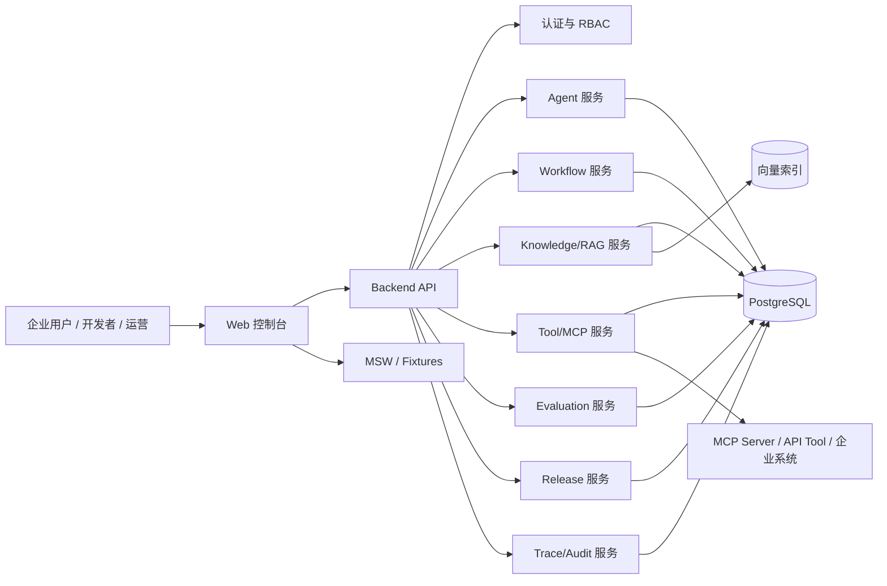

# 前后端总体设计方案

## 1. 目标与边界

本文将已确认的 Open Design 原型转换为可落地的前后端工程设计。设计目标是支撑 MVP 主闭环：

`创建 Agent -> 绑定知识库/工具 -> 工作流调试 -> 评测 -> 发布 API -> Trace 观测 -> 审计回溯`

当前阶段只定义总体设计，不初始化工程、不实现业务代码。后续实施时应先完成可运行的前端骨架与 mock API，再逐步接入后端服务和真实能力。

## 2. 总体架构

系统采用前后端分离架构，前端负责控制台交互、工作流画布、配置表单、运行观测和发布门禁展示；后端负责领域资源、权限、工作流执行、知识库流水线、工具调用、评测、发布和审计。



MVP 可先采用单体后端模块化实现，避免过早拆分微服务。模块边界要清晰，后续可以按 Agent、Workflow、Knowledge、Tool/MCP、Trace/Audit 逐步拆分。

## 3. 前端设计

### 3.1 推荐技术栈

- React + TypeScript：承载控制台复杂交互和强类型领域模型。
- Vite：用于快速启动 MVP 前端工程。
- React Router：管理控制台路由、详情页、嵌套路由和深链。
- Tailwind CSS：承载设计 token、布局、状态色和响应式规则。
- shadcn/ui 或 Radix + 自建封装：提供表单、弹窗、抽屉、Tabs、Tooltip、Popover 等基础交互。
- lucide-react：统一线性图标。
- TanStack Query：服务端数据获取、缓存、轮询、失效和错误状态。
- Zustand：只保存客户端 UI 状态、画布临时状态、筛选器草稿和面板展开状态。
- React Hook Form + Zod：复杂配置表单、运行时校验和 API schema 对齐。
- React Flow：工作流画布、节点、边、选择态、运行态和调试态。
- TanStack Table：Agent、工具、知识库、运行日志、评测结果等高密度表格。
- Recharts：MVP 指标图表；复杂诊断图可在 P1 评估 ECharts。
- GSAP：页面进入、视图切换、面板展开、工作流节点运行态等明确动效。
- MSW：前端无后端阶段的浏览器 mock API。
- Vitest + React Testing Library + Playwright：单元测试、组件测试和关键流程 E2E。

### 3.2 前端目录规划

```txt
apps/web/
  src/
    app/
      App.tsx
      router.tsx
      providers.tsx
      query-client.ts
    components/
      ui/
      layout/
      data-display/
      forms/
      workflow/
      feedback/
    features/
      dashboard/
      agents/
      workflows/
      knowledge/
      tools/
      evaluations/
      releases/
      runs/
      governance/
    lib/
      api/
      auth/
      mock/
      permissions/
      formatting/
      validation/
    stores/
      ui-store.ts
      workflow-store.ts
      workspace-store.ts
    styles/
      globals.css
      tokens.css
    types/
      domain.ts
      api.ts
    test/
      setup.ts
      factories/
```

目录职责：

- `app`：应用入口、路由、Provider、QueryClient。
- `components/ui`：无业务语义的基础组件。
- `components/layout`：控制台壳层、侧边导航、顶部栏、页面标题、分栏布局。
- `components/data-display`：指标卡、状态标签、数据表格、Trace 时间线、空状态和错误状态。
- `components/forms`：字段组、权限选择、变量编辑器、Schema Viewer、密钥输入。
- `components/workflow`：React Flow 节点、边、节点库、属性面板、调试面板。
- `features/*`：按业务域组织页面、领域组件、hooks、queries、schemas 和 mock adapter。
- `lib/api`：API client、query key、错误处理、请求/响应类型。
- `stores`：只存客户端交互状态，不替代服务端缓存。

### 3.3 路由设计

P0 路由应直接覆盖确认版原型的 10 个视图，并为详情页预留深链。

```txt
/dashboard
/strategy
/agents
/agents/new
/agents/:agentId
/agents/:agentId/config
/agents/:agentId/resources
/agents/:agentId/workflow
/workflows/:workflowId
/knowledge
/knowledge/:knowledgeBaseId
/tools
/tools/mcp-servers
/tools/mcp-servers/:serverId
/tools/:toolId
/evaluations
/evaluations/datasets/:datasetId
/evaluations/runs/:evaluationRunId
/runs
/runs/:runId
/releases
/releases/:releaseId
/marketplace
/governance
/settings/workspaces
/settings/members
/settings/secrets
/settings/audit-logs
```

MVP 默认入口为 `/dashboard`。工作流编辑器既可从 `/agents/:agentId/workflow` 进入，也可通过 `/workflows/:workflowId` 独立深链访问。

### 3.4 组件分层

核心壳层组件：

- `AppShell`
- `SidebarNav`
- `Topbar`
- `WorkspaceProjectSwitcher`
- `EnvironmentSwitcher`
- `PageHeader`
- `PageActions`

核心业务组件：

- `MetricCard`
- `StatusPill`
- `DataTable`
- `FilterBar`
- `InspectorPanel`
- `ReleaseGateChecklist`
- `TraceTimeline`
- `ResourceBindingList`
- `PermissionMatrix`
- `SchemaViewer`
- `SecretField`

工作流组件：

- `WorkflowCanvas`
- `WorkflowNode`
- `WorkflowEdge`
- `NodePalette`
- `NodeInspector`
- `WorkflowDebugPanel`
- `RunStatusOverlay`

### 3.5 前端状态边界

服务端状态交给 TanStack Query：

- Agent 列表、详情、版本、资源绑定。
- Workflow 定义、节点、边、运行结果。
- KnowledgeBase、Document、Chunk、RetrievalTest。
- Tool、MCPServer、Credential、ToolHealth。
- EvaluationDataset、EvaluationRun、EvaluationReport。
- Release、Channel、ReleaseGate。
- Trace、TraceStep、AuditLog。

客户端状态交给 Zustand：

- 当前 workspace/project/environment 选择。
- 侧边栏折叠、面板展开、命令面板。
- 工作流画布选中节点、临时拖拽、调试面板高度。
- 表格筛选器草稿和本地排序偏好。

### 3.6 GSAP 动效边界

前端 UI 必须遵守项目规则，动效使用 GSAP，并保持企业控制台的克制感。

P0 动效范围：

- 页面首次进入：侧边栏、顶部栏、主内容轻量淡入。
- 路由切换：当前页面主面板短时淡入与轻微位移。
- 工作流调试：节点按执行顺序出现运行态脉冲，错误节点突出显示。
- 抽屉/属性面板：打开和切换时使用短时位移。

约束：

- 必须支持 `prefers-reduced-motion`。
- 不用动效表达核心状态，状态必须通过文本、颜色和图标可读。
- 动画只作用于 transform、opacity 等低成本属性。
- 不在表格大量行上做持续动画。

## 4. 后端设计

### 4.1 推荐技术栈

后端可在 FastAPI 与 NestJS 中二选一。结合当前项目文档和 AI/RAG 生态，推荐 MVP 优先使用 FastAPI：

- FastAPI：API 开发、OpenAPI 文档、异步任务接口友好。
- Pydantic：请求响应模型和领域 DTO 校验。
- SQLAlchemy 2.x 或 SQLModel：关系数据建模。
- Alembic：数据库迁移。
- PostgreSQL：主业务数据库。
- pgvector 或独立向量库：MVP 优先 pgvector，后续按规模切换 Milvus/Qdrant。
- Redis：任务状态、短期缓存、限流和执行队列。
- Celery/RQ/Arq：知识库处理、评测运行、异步工作流任务。
- OpenTelemetry：Trace 采集预留。

如果团队更偏 TypeScript 全栈，可选择 NestJS + Prisma，但需要额外处理 RAG/模型生态集成成本。

### 4.2 后端模块边界

```txt
apps/api/
  app/
    main.py
    core/
      config.py
      security.py
      database.py
      errors.py
    modules/
      identity/
      workspace/
      agent/
      workflow/
      knowledge/
      tool/
      evaluation/
      release/
      trace/
      audit/
    workers/
      knowledge_jobs.py
      evaluation_jobs.py
      workflow_jobs.py
    tests/
```

模块职责：

- `identity`：用户、角色、会话、API Key、服务调用身份。
- `workspace`：空间、项目、成员关系和环境。
- `agent`：Agent、版本、模型策略、Prompt、资源绑定。
- `workflow`：工作流定义、节点、边、运行调试和执行快照。
- `knowledge`：知识库、文档、解析、切分、向量化、检索测试。
- `tool`：MCP Server、工具、API Tool、凭据、工具健康。
- `evaluation`：测试集、用例、批量评测、评分和报告。
- `release`：发布渠道、版本快照、发布门禁、回滚。
- `trace`：运行记录、步骤、模型调用、工具调用、检索命中。
- `audit`：权限变更、高风险操作、发布、密钥和资源访问审计。

## 5. 数据模型初稿

P0 建议优先落以下核心表。字段在实现时再补充类型、索引和约束。

### 5.1 组织与权限

- `users`
- `workspaces`
- `projects`
- `workspace_members`
- `roles`
- `role_permissions`
- `api_keys`
- `audit_logs`

核心关系：

- 一个 Workspace 有多个 Project。
- 用户通过 `workspace_members` 获得角色。
- 资源默认归属 Project 或 Workspace。
- 审计日志必须记录操作者、资源、动作、结果和上下文。

### 5.2 Agent 与版本

- `agents`
- `agent_versions`
- `agent_resource_bindings`
- `model_policies`
- `prompt_templates`

关键点：

- `agents.current_draft_version_id` 指向草稿版本。
- `agents.current_published_version_id` 指向已发布版本。
- 发布必须使用不可变版本快照。
- 资源绑定包括知识库、工具、数据库连接和工作流。

### 5.3 Workflow

- `workflows`
- `workflow_versions`
- `workflow_nodes`
- `workflow_edges`
- `workflow_runs`

关键点：

- 工作流定义与运行快照分离。
- 节点配置保存为 JSON，但节点类型和关键权限字段要可索引。
- 运行时保存节点输入、输出摘要、错误、耗时和成本。

### 5.4 Knowledge/RAG

- `knowledge_bases`
- `documents`
- `document_chunks`
- `document_processing_jobs`
- `retrieval_configs`
- `retrieval_logs`

关键点：

- 知识库是平台级资源，可被多个 Agent 引用。
- 文档处理状态要可追踪和可重试。
- Chunk 需要保留来源、位置、版本和更新时间，用于回答引用。
- MVP 可先支持语义检索，Hybrid Search 和 Rerank 保留接口。

### 5.5 Tool/MCP

- `mcp_servers`
- `tools`
- `api_tools`
- `credentials`
- `tool_permissions`
- `tool_health_checks`
- `tool_call_logs`

关键点：

- 凭据不直接明文入库，应接入密钥管理或至少加密存储。
- 工具 schema 需要版本化，避免 schema drift 影响已发布 Agent。
- 高风险写操作必须绑定确认规则。

### 5.6 Evaluation/Release/Trace

- `evaluation_datasets`
- `evaluation_cases`
- `evaluation_runs`
- `evaluation_results`
- `releases`
- `release_channels`
- `release_gates`
- `runs`
- `trace_steps`

关键点：

- Release 绑定 AgentVersion 和 WorkflowVersion 快照。
- ReleaseGate 必须能解释阻断原因。
- TraceStep 需要统一表示模型、检索、工具、数据库、代码和人工确认步骤。

## 6. API 设计原则

### 6.1 API 风格

- 使用 REST API 作为 MVP 主接口。
- 使用 OpenAPI 自动生成接口文档。
- 资源路径使用复数名词。
- 写操作返回最新资源快照。
- 批量任务返回 job/run id，前端轮询或订阅状态。

### 6.2 P0 API 分组

```txt
/api/workspaces
/api/projects
/api/agents
/api/agent-versions
/api/workflows
/api/workflow-runs
/api/knowledge-bases
/api/documents
/api/retrieval-tests
/api/mcp-servers
/api/tools
/api/credentials
/api/evaluation-datasets
/api/evaluation-runs
/api/releases
/api/release-gates
/api/runs
/api/traces
/api/audit-logs
```

### 6.3 关键接口样例

创建 Agent：

```http
POST /api/agents
```

保存工作流草稿：

```http
PUT /api/workflows/{workflowId}
```

运行工作流调试：

```http
POST /api/workflows/{workflowId}/runs
```

运行评测：

```http
POST /api/evaluation-datasets/{datasetId}/runs
```

执行发布检查：

```http
POST /api/agents/{agentId}/release-gates/check
```

发布 Agent：

```http
POST /api/agents/{agentId}/releases
```

获取 Trace：

```http
GET /api/runs/{runId}/trace
```

## 7. 权限与安全设计

### 7.1 角色

P0 角色：

- Owner：空间所有者，拥有全部权限。
- Admin：空间管理、成员、密钥、发布和审计。
- Developer：创建和编辑 Agent、Workflow、Tool 绑定和调试。
- Operator：知识库、评测、发布检查和运行观测。
- Viewer：只读查看。

### 7.2 权限维度

- Workspace 权限：成员、项目、全局密钥、审计。
- Project 权限：Agent、Workflow、Release。
- Resource 权限：KnowledgeBase、Tool、Credential、DatabaseConnection。
- Action 权限：read、create、update、delete、run、publish、rollback、approve。

### 7.3 高风险操作

以下操作默认需要显式确认和审计：

- 数据库写入。
- 外部 API 写操作。
- 本地文件写入。
- 代码执行。
- 敏感文件读取。
- 跨 Agent 委托。
- 生产发布和回滚。
- 密钥创建、更新、删除。

高风险操作的确认结果必须写入 `audit_logs`，Trace 中也要能看到阻断或放行原因。

## 8. MVP 实施切片

### 8.1 P0-1：前端可运行骨架

目标：把确认版原型工程化为可运行 React 控制台。

范围：

- 初始化 `apps/web`。
- 建立 AppShell、SidebarNav、Topbar、PageHeader。
- 接入 Tailwind tokens、GSAP 基础动效。
- 建立 mock 数据和 MSW。
- 实现 Dashboard、Agent Studio、Workflow、Trace/Observe 的核心静态页面。

验收：

- 本地启动后可访问 10 个一级视图。
- 页面结构与确认版原型保持一致。
- 关键视图在桌面和 390px 移动端无页面级横向溢出。

### 8.2 P0-2：前端领域状态与 mock API

目标：让主闭环能通过 mock API 跑通。

范围：

- Agent 创建草稿。
- 绑定知识库和工具。
- 工作流保存与调试。
- 评测运行结果展示。
- 发布门禁阻断原因展示。
- Trace 详情展示。

验收：

- 不依赖真实后端也能演示完整闭环。
- 所有 mock 响应有 Zod schema 校验。

### 8.3 P0-3：后端基础骨架

目标：建立真实 API 与数据库基础。

范围：

- 初始化 `apps/api`。
- 配置 PostgreSQL、迁移、OpenAPI。
- 实现 Workspace、Project、Agent、Workflow、Run、Trace 的基础 CRUD。
- 接入基础 RBAC 和审计日志。

验收：

- 前端可从 mock API 平滑切换到真实 API。
- 所有写操作有审计记录。

### 8.4 P0-4：知识库、工具、评测、发布

目标：把主闭环从配置演示推进到真实业务闭环。

范围：

- 知识库文档导入与处理任务。
- 工具/MCP 注册与健康检查。
- 评测数据集和评测运行。
- 发布门禁与发布记录。

验收：

- 发布阻断原因来自真实评测、工具健康和资源权限。
- Trace 能展示检索、工具和模型步骤的统一结构。

## 9. 测试策略

前端：

- Vitest：格式化函数、权限判断、schema 转换、状态 store。
- React Testing Library：表单、面板、发布门禁、TraceTimeline。
- Playwright：主闭环 E2E、导航响应式、工作流调试、发布阻断。

后端：

- 单元测试：服务层权限、领域规则、schema 校验。
- API 测试：核心 CRUD、发布检查、Trace 查询。
- 集成测试：数据库迁移、异步任务、工具健康检查。

验收级测试：

- 创建 Agent 并保存草稿。
- 绑定知识库和工具。
- 工作流调试生成 Run 和 Trace。
- 运行评测并产生 ReleaseGate。
- 发布被阻断时返回明确原因。
- 高风险操作写入审计日志。

## 10. 暂不纳入 P0 的事项

- 完整插件市场。
- 完整企业 SSO。
- 多租户商业计费。
- 复杂 Agent-to-Agent 协作。
- 高级灰度发布和 A/B 实验。
- 完整 Hybrid Search/Rerank 优化。
- 全量企业连接器，如 Confluence、飞书、钉钉、Git、对象存储。
- 生产级模型路由、限流和成本优化。

## 11. 下一步

建议在本文确认后编写《MVP 实施计划》，把 P0-1 到 P0-4 拆成可执行任务，并明确每一步的文件范围、验收命令和回滚方式。确认实施计划后，再初始化 `apps/web` 前端工程。
